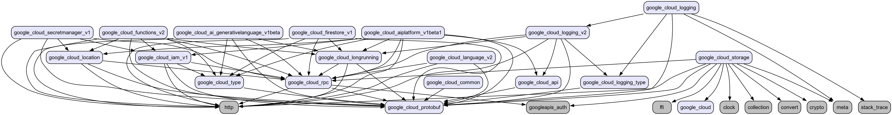

# Developer's Guide

## Layout

- `examples/`: various examples of Google Cloud client usage
- `generated/`: the generated Google Cloud API packages
- `packages/`: hand-written API and support packages
- `tests/`: unit and integration tests for the generated cloud APIs

The dependency graph for the current set of packages:



## Testing

### Running against Google Cloud

Some integration tests require access to a real Google Cloud project. These tests are tagged with `@Tags(['google-cloud'])` and are not run by default,
i.e., `dart test` will not run them.

To run these tests:

1.  **Configure your project:**
    ```bash
    $ gcloud config set project <project-id>
    ```

> [!NOTE]
> You can create a new Google Cloud project for testing using the
> [Google Cloud Console].

2.  **Authenticate:**
    ```bash
    $ gcloud auth application-default login
    ```

> [!NOTE]
> Some tests may require additional scopes. For example:
> ```bash
> $ gcloud auth application-default login --scopes=https://www.googleapis.com/auth/cloud-platform,https://www.googleapis.com/auth/generative-language
> ```

3.  **Run the tests:**
    ```bash
    $ # NOTE: you can run this command in the repository root directory (to
    $ # run all tests) or in any subdirectory (to run only the tests in that
    $ # subdirectory).
    $ GOOGLE_CLOUD_PROJECT=$(gcloud config get-value project) dart test . -P google-cloud
    ```

#### Troubleshooting

*   **Missing Scopes:** If a test fails with `insufficient_scope`, check the error message for the required scope URL and re-authenticate with that scope.
*   **Disabled APIs:** If a test fails with a `ForbiddenException` stating an API has not been used, follow the URL in the error message to enable the API in the Google Cloud Console.


## Developing

### Librarian

[Librarian](https://github.com/googleapis/librarian/blob/main/README.md)
is the tool used to generate Dart packages from API descriptions.

#### Regenerating the Dart packages

From the root of the project:

```bash
go run github.com/googleapis/librarian/cmd/librarian@main generate -all
```

> [!NOTE]
> You will have to [update Librarian](#updating-librarian) if you want to merge these changes.

#### Regenerating from a locally modified Librarian

Clone https://github.com/googleapis/librarian as a sibling directory to this
repo, make any desired changes to Librarian, then - from the root of the
project - run:

```bash
# Build the binary
go -C ../librarian build -o ../librarian/librarian ./cmd/librarian
# Run library regeneration
../librarian/librarian generate -all -f
```
> [!NOTE]
> Use `-f` to ignore the librarian version check since the local version is likely not the same
> as the one in [librarian.yaml](librarian.yaml).

#### Updating Librarian

[Workflow automation](.github/workflows/dart_checks.yaml) ensures that all
generated code matches what the generator would actually produce.

To prevent Librarian changes from causing workflow automation failures in this
repository, the version of Librarian used by this automation is pinned.

After making changes to Librarian you must 
[regenerate the Dart packages](#regenerating-the-dart-packages) and update
the version of Librarian used in the automation:
1. Find the head version of Librarian by running this command:
   
   `GOPROXY=direct go list -m -u -f '{{.Version}}' github.com/googleapis/librarian@main`
2. Modify the Librarian invocation in [.github/workflows/dart_checks.yaml](.github/workflows/dart_checks.yaml)

#### Updating API sources

Configuration for API source descriptions is found in the `[sources]`
section of the root [`librarian.yaml`](librarian.yaml).

You can update these sources to their latest versions by running
(from the root of the project):

```bash
go run github.com/googleapis/librarian/cmd/librarian@main update conformance googleapis protobuf showcase
```

[Google Cloud Console]: https://console.cloud.google.com/
