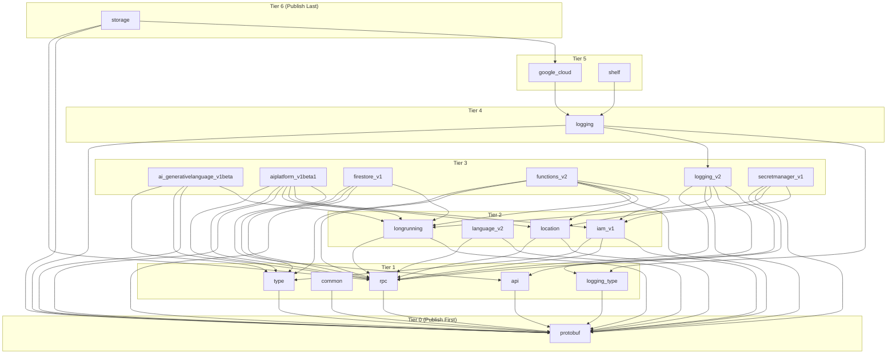

# Developer's Guide

## Layout

- `examples/`: various examples of Google Cloud client usage
- `generated/`: the generated Google Cloud API packages (see
  [`generated/README.md`](generated/README.md) for generation instructions)
- `pkgs/`: hand-written API and support packages (see
  [`pkgs/README.md`](pkgs/README.md) for package-specific instructions)
- `tests/`: unit and integration tests for the generated cloud APIs

The dependency graph for the current set of packages:

<!-- DEPS_DIAGRAM_START -->

```mermaid
graph TD
  subgraph Tier0 ["Tier 0 (Publish First)"]
    google_cloud_protobuf["protobuf"]
  end

  subgraph Tier1 ["Tier 1"]
    google_cloud_api["api"]
    google_cloud_common["common"]
    google_cloud_logging_type["logging_type"]
    google_cloud_rpc["rpc"]
    google_cloud_type["type"]
  end

  subgraph Tier2 ["Tier 2"]
    google_cloud_iam_v1["iam_v1"]
    google_cloud_language_v2["language_v2"]
    google_cloud_location["location"]
    google_cloud_longrunning["longrunning"]
  end

  subgraph Tier3 ["Tier 3"]
    google_cloud_ai_generativelanguage_v1beta["ai_generativelanguage_v1beta"]
    google_cloud_aiplatform_v1beta1["aiplatform_v1beta1"]
    google_cloud_firestore_v1["firestore_v1"]
    google_cloud_functions_v2["functions_v2"]
    google_cloud_logging_v2["logging_v2"]
    google_cloud_secretmanager_v1["secretmanager_v1"]
  end

  subgraph Tier4 ["Tier 4"]
    google_cloud_logging["logging"]
  end

  subgraph Tier5 ["Tier 5"]
    google_cloud["google_cloud"]
    google_cloud_shelf["shelf"]
  end

  subgraph Tier6 ["Tier 6 (Publish Last)"]
    google_cloud_storage["storage"]
  end

  google_cloud --> google_cloud_logging
  google_cloud_ai_generativelanguage_v1beta --> google_cloud_longrunning
  google_cloud_ai_generativelanguage_v1beta --> google_cloud_protobuf
  google_cloud_ai_generativelanguage_v1beta --> google_cloud_rpc
  google_cloud_ai_generativelanguage_v1beta --> google_cloud_type
  google_cloud_aiplatform_v1beta1 --> google_cloud_api
  google_cloud_aiplatform_v1beta1 --> google_cloud_iam_v1
  google_cloud_aiplatform_v1beta1 --> google_cloud_location
  google_cloud_aiplatform_v1beta1 --> google_cloud_longrunning
  google_cloud_aiplatform_v1beta1 --> google_cloud_protobuf
  google_cloud_aiplatform_v1beta1 --> google_cloud_rpc
  google_cloud_aiplatform_v1beta1 --> google_cloud_type
  google_cloud_api --> google_cloud_protobuf
  google_cloud_common --> google_cloud_protobuf
  google_cloud_firestore_v1 --> google_cloud_longrunning
  google_cloud_firestore_v1 --> google_cloud_protobuf
  google_cloud_firestore_v1 --> google_cloud_rpc
  google_cloud_firestore_v1 --> google_cloud_type
  google_cloud_functions_v2 --> google_cloud_iam_v1
  google_cloud_functions_v2 --> google_cloud_location
  google_cloud_functions_v2 --> google_cloud_longrunning
  google_cloud_functions_v2 --> google_cloud_protobuf
  google_cloud_functions_v2 --> google_cloud_rpc
  google_cloud_functions_v2 --> google_cloud_type
  google_cloud_iam_v1 --> google_cloud_protobuf
  google_cloud_iam_v1 --> google_cloud_rpc
  google_cloud_iam_v1 --> google_cloud_type
  google_cloud_language_v2 --> google_cloud_protobuf
  google_cloud_language_v2 --> google_cloud_rpc
  google_cloud_location --> google_cloud_protobuf
  google_cloud_location --> google_cloud_rpc
  google_cloud_logging --> google_cloud_logging_type
  google_cloud_logging --> google_cloud_logging_v2
  google_cloud_logging --> google_cloud_protobuf
  google_cloud_logging_type --> google_cloud_protobuf
  google_cloud_logging_v2 --> google_cloud_api
  google_cloud_logging_v2 --> google_cloud_logging_type
  google_cloud_logging_v2 --> google_cloud_longrunning
  google_cloud_logging_v2 --> google_cloud_protobuf
  google_cloud_logging_v2 --> google_cloud_rpc
  google_cloud_longrunning --> google_cloud_protobuf
  google_cloud_longrunning --> google_cloud_rpc
  google_cloud_rpc --> google_cloud_protobuf
  google_cloud_secretmanager_v1 --> google_cloud_iam_v1
  google_cloud_secretmanager_v1 --> google_cloud_location
  google_cloud_secretmanager_v1 --> google_cloud_protobuf
  google_cloud_secretmanager_v1 --> google_cloud_rpc
  google_cloud_shelf --> google_cloud_logging
  google_cloud_storage --> google_cloud
  google_cloud_storage --> google_cloud_protobuf
  google_cloud_storage --> google_cloud_rpc
  google_cloud_type --> google_cloud_protobuf
```
<!-- DEPS_DIAGRAM_END -->

## Testing

Code changes should be covered by tests. Prefer integration tests to mocks
when writing tests for code that communicates directly with Google Cloud
services.

### Running against Google Cloud

Some integration tests require access to a real Google Cloud project. These
tests are tagged with `@Tags(['google-cloud'])` and are not run by default,
i.e., `dart test` will not run them.

To run these tests locally (they are automatically run for PRs using
[Google Cloud Build](.gcb)):

1.  **Configure your project:**
    ```bash
    $ gcloud config set project <project-id>
    ```

> [!NOTE]
> You can create a new Google Cloud project for testing using the
> [Google Cloud Console].

2.  **Authenticate:**
    ```bash
    $ gcloud auth application-default login
    ```

> [!NOTE]
> Some tests may require additional scopes. For example:
> ```bash
> $ gcloud auth application-default login --scopes=https://www.googleapis.com/auth/cloud-platform,https://www.googleapis.com/auth/generative-language
> ```

3.  **Run the tests:**
    ```bash
    $ # NOTE: you can run this command in the repository root directory (to
    $ # run all tests) or in any subdirectory (to run only the tests in that
    $ # subdirectory).
    $ GOOGLE_CLOUD_PROJECT=$(gcloud config get-value project) dart test . -P google-cloud
    ```

#### Troubleshooting

*   **Missing Scopes:** If a test fails with `insufficient_scope`, check the error message for the required scope URL and re-authenticate with that scope.
*   **Disabled APIs:** If a test fails with a `ForbiddenException` stating an API has not been used, follow the URL in the error message to enable the API in the Google Cloud Console.

### Running against the Firebase Emulators Suite

Some integration tests require access to the [Firebase Emulators Suite][]. These
tests are tagged with `@Tags(['firebase-emulator'])` and are not run by default,
i.e., `dart test` will not run them.

To run these tests locally (they are automatically run for PRs using a GitHub workflow):

```bash
$ firebase emulators:exec \
    --config=firestore_emulators/firebase.json \
    "GOOGLE_CLOUD_PROJECT=test-project dart test -P firebase-emulator ."
```

See the [Firebase emulator configuration](firestore_emulators/).

## Pull Requests

* PRs should follow [Conventional Commits][]
* If the PR applies to a single package, then the package name, with the
  "google_cloud" prefix removed, should be included in the PR scope. For
  example, for a documentation changes to `package:google_cloud_storage`,
  `docs(storage): clarify retry logic`.

## Maintainers

The ability to triage issues, merge PRs, and assign reviewers is limited to 
members of the [`cloud-sdk-dart-team`][] GitHub team.

Team members also have access to the [`dart-sdk-testing`][] Google Cloud
project, which is used for running integration tests.

PRs created by team members will automatically have Google Cloud integration
tests run for them. Team members can manually trigger Google Cloud integration
tests by commenting `/gcbrun` on the PR.

[Google Cloud Console]: https://console.cloud.google.com/
[Conventional Commits]: https://www.conventionalcommits.org/
[`cloud-sdk-dart-team`]: https://github.com/orgs/googleapis/teams/cloud-sdk-dart-team
[`dart-sdk-testing`]: https://pantheon.corp.google.com/welcome?project=dart-sdk-testing
[Firebase Emulators Suite]: https://firebase.google.com/docs/emulator-suite
