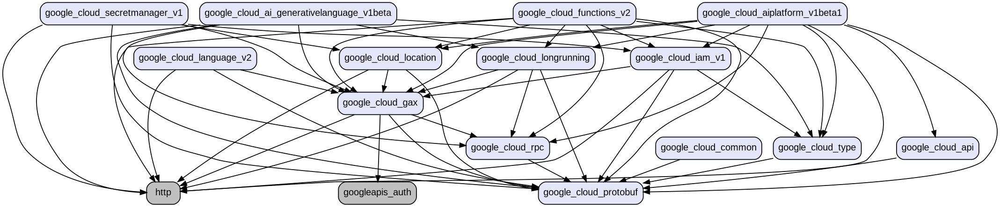

# Developer's Guide

## Layout

- `examples/`: various examples of Google Cloud client usage
- `generated/`: the generated Google Cloud API packages
- `packages/`: hand-written API and support packages
- `tests/`: unit and integration tests for the generated cloud APIs

The dependency graph for the current set of packages:



## Developing

### Librarian

[Librarian](https://github.com/googleapis/librarian/blob/main/README.md)
is the tool used to generate Dart packages from API descriptions.

#### Regenerating the Dart packages

From the root of the project:

```bash
go run github.com/googleapis/librarian/cmd/librarian@main generate -all
```

> [!NOTE]
> You will have to [update Librarian](#updating-librarian) if you want to merge these changes.

#### Regenerating from a locally modified Librarian

Clone https://github.com/googleapis/librarian as a sibling directory to this
repo, make any desired changes to Librarian, then - from the root of the
project - run:

```bash
# Build the binary
go -C ../librarian build -o ../librarian/librarian ./cmd/librarian
# Run library regeneration
../librarian/librarian generate -all -f
```
> [!NOTE]
> Use `-f` to ignore the librarian version check since the local version is likely not the same
> as the one in [librarian.yaml](librarian.yaml).

#### Updating Librarian

[Workflow automation](.github/workflows/dart_checks.yaml) ensures that all
generated code matches what the generator would actually produce.

To prevent Librarian changes from causing workflow automation failures in this
repository, the version of Librarian used by this automation is pinned.

After making changes to Librarian you must 
[regenerate the Dart packages](#regenerating-the-dart-packages) and update
the version of Librarian used in the automation:
1. Find the head version of Librarian by running this command:
   
   `GOPROXY=direct go list -m -u -f '{{.Version}}' github.com/googleapis/librarian@main`
2. Modify the Librarian invocation in [.github/workflows/dart_checks.yaml](.github/workflows/dart_checks.yaml)

#### Updating API sources

Configuration for API source descriptions is found in the `[sources]`
section of the root [`librarian.yaml`](librarian.yaml).

You can update these sources to their latest versions by running
(from the root of the project):

```bash
go run github.com/googleapis/librarian/cmd/librarian@main update -all
```

### Testing

Some generated packages contain integration tests, e.g.,
[`package:google_cloud_ai_generativelanguage_v1beta`](generated/google_cloud_ai_generativelanguage_v1beta/test/).

By default, these tests use a recorded version of the interation between the
API client and the server.

If new tests are added or the communication between the API client and the
server changes, these changes must be regenerated with:

```bash
cd generated && dart --define=http=record test . -c vm:source
```
