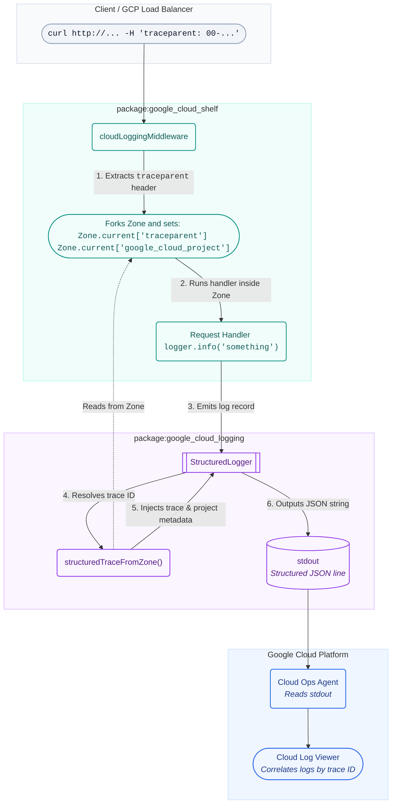

# Package Architecture: package:google_cloud_logging

This document explains how `package:google_cloud_logging` is designed, with a
focus on how it interacts with `package:google_cloud_shelf` using Dart
[Zones](https://api.dart.dev/stable/dart-async/Zone-class.html) to correlate
logs with incoming HTTP requests.

---

## Overview

`package:google_cloud_logging` provides structured logging for Dart applications
running on Google Cloud Platform (GCP). The core of the package is the
[`StructuredLogger`](lib/src/structured_logger.dart) class, which formats log
entries into a JSON format that GCP's logging agent (`google-fluentd` or the
built-in Cloud Ops agent) can automatically parse and ingest.

While emitting [structured log payloads](https://cloud.google.com/logging/docs/structured-logging)
is straightforward, the real challenge is **Log Correlation** (associating
individual log records with the specific HTTP request that triggered them). This
is achieved using Dart `Zone` variables.

---

## How Log Correlation Works

When an HTTP request is processed in a Google Cloud environment, it usually
carries a `traceparent` header (as defined by the
[W3C Trace Context specification](https://www.w3.org/TR/trace-context/)). To
correlate application logs with the request logs, every log entry must include
special fields linking it to the trace ID.

Instead of forcing developers to manually pass a logger or request context
through every function call, this repository leverages Dart's
[Zone](https://api.dart.dev/stable/dart-async/Zone-class.html) mechanism to flow
context implicitly across asynchronous boundaries.

### The Cross-Package Interaction

The interaction spans two packages:
1. **`package:google_cloud_shelf` (The Writer):** Intercepts incoming HTTP
   requests and creates a new asynchronous context (a `Zone`) with variables.
2. **`package:google_cloud_logging` (The Reader):** Reads the variables from the
   current `Zone` when a log record is emitted and constructs the appropriate
   GCP payload.

