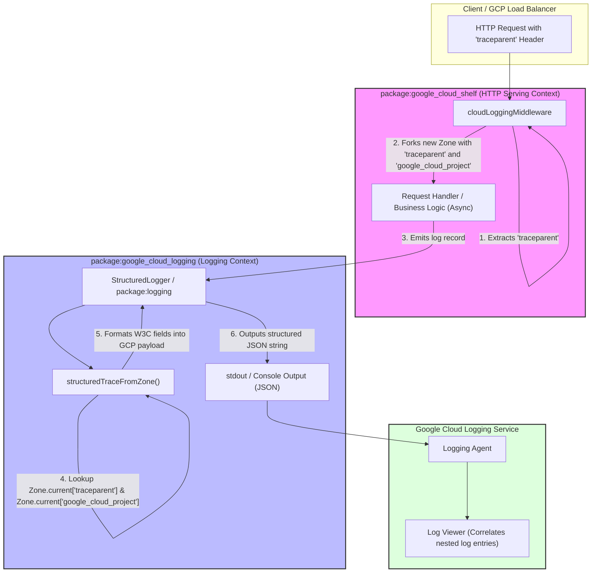

# Package Architecture: package:google_cloud_logging

This document explains how `package:google_cloud_logging` is designed, with a
focus on how it interacts with `package:google_cloud_shelf` using Dart
[Zones](https://api.dart.dev/stable/dart-async/Zone-class.html) to correlate
logs with incoming HTTP requests.

---

## Overview

`package:google_cloud_logging` provides structured logging for Dart applications
running on Google Cloud Platform (GCP). The core of the package is the
[`StructuredLogger`](lib/src/structured_logger.dart) class, which formats log
entries into a JSON format that GCP's logging agent (`google-fluentd` or the
built-in Cloud Ops agent) can automatically parse and ingest.

While emitting [structured log payloads](https://cloud.google.com/logging/docs/structured-logging)
is straightforward, the real challenge is **Log Correlation** (associating
individual log records with the specific HTTP request that triggered them). This
is achieved using Dart `Zone` variables.

---

## How Log Correlation Works

When an HTTP request is processed in a Google Cloud environment, it usually
carries a `traceparent` header (as defined by the
[W3C Trace Context specification](https://www.w3.org/TR/trace-context/)). To
correlate application logs with the request logs, every log entry must include
special fields linking it to the trace ID.

Instead of forcing developers to manually pass a logger or request context
through every function call, this repository leverages Dart's
[Zone](https://api.dart.dev/stable/dart-async/Zone-class.html) mechanism to flow
context implicitly across asynchronous boundaries.

### The Cross-Package Interaction

The interaction spans two packages:
1. **`package:google_cloud_shelf` (The Writer):** Intercepts incoming HTTP
   requests and creates a new asynchronous context (a `Zone`) with variables.
2. **`package:google_cloud_logging` (The Reader):** Reads the variables from the
   current `Zone` when a log record is emitted and constructs the appropriate
   GCP payload.



---

## Implementation Details

### 1. Storing Variables in the Zone (google_cloud_shelf)

Inside `package:google_cloud_shelf`'s
[`cloudLoggingMiddleware`](../google_cloud_shelf/lib/src/http_logging.dart),
the request handler is executed in a forked `Zone` with the trace and project
ID embedded in `zoneValues`:

```dart
Zone.current
    .fork(
      zoneValues: {
        'google_cloud_project': projectId,
        'traceparent': request.headers['traceparent'],
      },
      specification: ZoneSpecification(
        handleUncaughtError: uncaughtErrorHandler,
        print: zonePrint,
      ),
    )
    .runGuarded(() async {
      final response = await innerHandler(request);
      ...
    });
```

*   **`'google_cloud_project'`**: The GCP Project ID, which is needed to
    formulate the fully-qualified trace name path.
*   **`'traceparent'`**: The raw W3C header value. A typical header value
    looks like: `00-4bf92f3577b34da6a3ce929d0e0e4736-00f067aa0ba902b7-01`

### 2. Extracting Variables from the Zone (google_cloud_logging)

When `StructuredLogger` handles a log record (either directly or via the
`package:logging` handler), it calls `createStructuredLog`. This delegates to
[`structuredTraceFromZone`](lib/src/traceparent.dart):

```dart
Map<String, Object> structuredTraceFromZone(String? projectId, [Zone? zone]) {
  final traceparent = (zone ?? Zone.current)['traceparent'];
  final String? calculatedProjectId;
  if (projectId == null) {
    calculatedProjectId =
        (zone ?? Zone.current)['google_cloud_project'] as String?;
  } else {
    calculatedProjectId = projectId;
  }

  if (traceparent is String) {
    return formatTraceparent(calculatedProjectId, traceparent);
  } else {
    return {};
  }
}
```

`Zone.current['key']` performs a lookup in the current zone or any of its
parent zones, allowing `google_cloud_logging` to retrieve the values seamlessly
without having any dependency on `package:google_cloud_shelf` or requiring
explicit context objects.

### 3. Parsing and Formatting

Once `traceparent` is fetched, it is parsed into three components:
- **Trace ID**: The 32-character hex string.
- **Span ID** (Parent ID): The 16-character hex string.
- **Trace Sampled**: A boolean flag indicating if the trace was sampled.

These are mapped to [special payload fields](https://cloud.google.com/logging/docs/structured-logging#special-payload-fields)
that Google Cloud Logging recognizes:

```dart
{
  'logging.googleapis.com/trace': 'projects/$projectId/traces/$traceId',
  'logging.googleapis.com/spanId': spanId,
  'logging.googleapis.com/trace_sampled': traceSampled,
}
```

When these fields are included in the structured console output (`stdout`/`stderr`),
the Cloud Logging agent automatically links the message to the active HTTP
request log.
